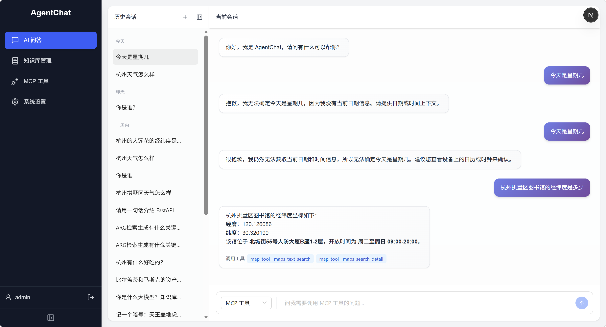
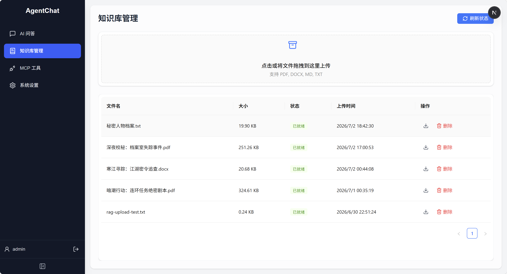
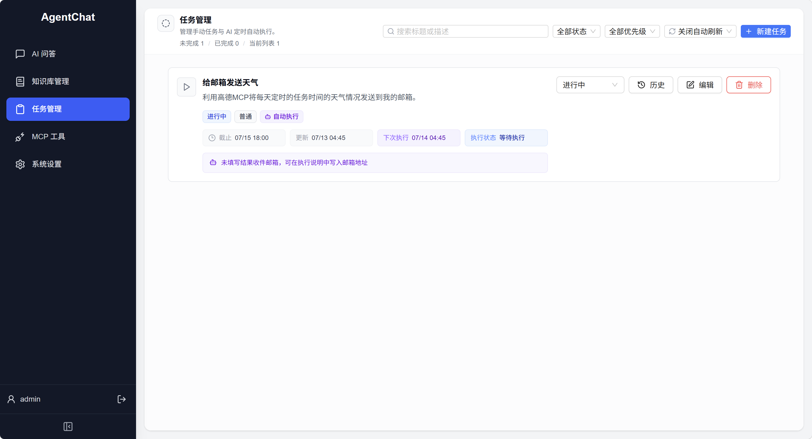
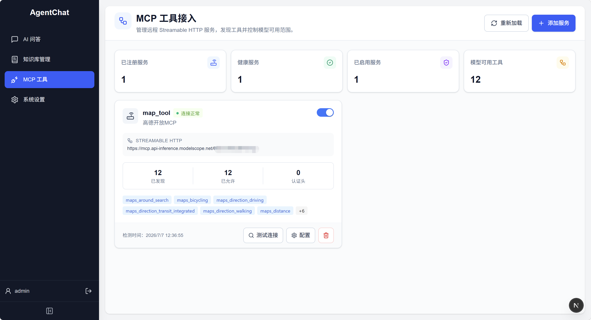
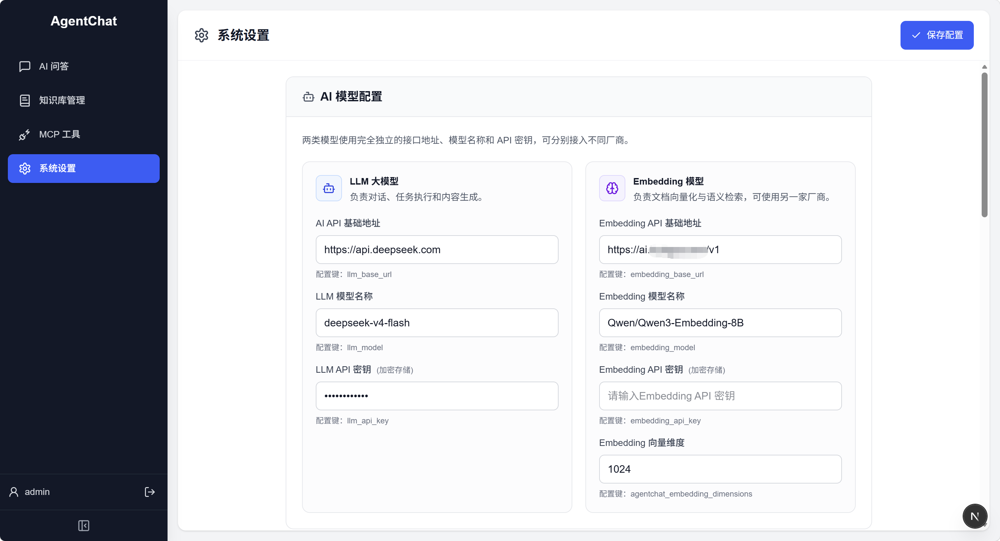

# AgentChat

AgentChat 是一个前后端分离的 AI 对话、知识库、自动任务与 MCP 工具接入应用。后端基于 FastAPI、SQLAlchemy、LangChain、LangChain MCP Adapters、Milvus、Redis 和 ARQ，前端基于 Next.js、React、Ant Design X 与 Tailwind CSS。

项目目前提供流式 AI 对话、智能助手自动路由、会话历史、文档上传与向量化、RAG 知识库问答、MCP 工具助手、AI 自动任务、JWT 登录、管理员系统配置和 MCP Server 管理页面。

## 界面示例

### AI 问答



### 知识库管理



### 自动任务



### MCP 工具接入



### 系统设置



## 功能概览

- AI 对话：支持智能助手、普通对话、知识库和 MCP 工具模式；普通对话、智能助手和 RAG 支持 SSE 流式输出
- 智能助手：按问题自动选择直接回答、RAG 检索或 MCP 工具调用，并通过进度事件展示工具状态
- 知识库问答：检索 Milvus 中的相关文档分片，流式返回回答并展示来源
- MCP 工具助手：由管理员注册远程 Streamable HTTP MCP Server，模型可调用白名单内工具；前端以状态小卡片展示工具调用中、完成或失败
- MCP 工具管理：支持添加、测试、启停、删除 MCP Server，配置认证 Header、工具白名单、调用超时和结果长度限制
- 文档管理：上传、解析、索引、进度展示、下载和删除 PDF、DOCX、Markdown、TXT
- 任务管理：登录用户任务工作台、状态/优先级/关键词筛选、自动刷新倒计时、AI 定时自动执行、每日重复、结果邮件和执行记录
- 用户认证：JWT 登录、当前用户查询、管理员权限校验
- 系统配置：管理员维护 LLM、Embedding、邮件、通知和向量库配置，敏感值加密存储并脱敏展示
- 邮件通知：文档索引成功或失败后发送处理结果通知
- 响应式前端：桌面侧栏与移动端底部导航，支持普通对话、知识库和 MCP 工具模式切换

## 技术栈

| 层级 | 技术 |
| --- | --- |
| 前端 | Next.js 16、React 19、TypeScript、Ant Design 6、Ant Design X、Tailwind CSS 4、Axios |
| 后端 | Python 3.11–3.13、FastAPI、SQLAlchemy 2、Pydantic |
| AI | LangChain、LangChain MCP Adapters、OpenAI 兼容的 Chat Completions / Embeddings API |
| 数据 | PostgreSQL 或 SQLite、Milvus、Redis |
| 认证与安全 | JWT、bcrypt、Fernet 加密 |
| 工程化 | uv、pytest、Ruff、npm / pnpm、ESLint |

## 项目结构

```text
AgentChat/
├─ backend/
│  ├─ app/
│  │  ├─ ai/                 # 模型、Prompt、Chain、Agent、RAG 与文档解析
│  │  ├─ mcp/                # MCP Server 注册表与 LangChain 工具适配
│  │  ├─ routers/            # AI、任务、认证和系统配置路由
│  │  ├─ services/           # 认证、配置、加密、邮件、任务队列和任务执行器
│  │  ├─ crud.py             # 数据访问操作
│  │  ├─ database.py         # SQLAlchemy 引擎与会话
│  │  ├─ models.py           # ORM 模型
│  │  ├─ schemas.py          # API 数据模型
│  │  └─ main.py             # FastAPI 应用入口与文档接口
│  ├─ docs/                  # 启动时可加入 RAG 的内置示例文档
│  ├─ tests/                 # pytest 测试
│  ├─ .env.example           # 后端环境变量示例
│  └─ pyproject.toml         # Python 依赖与工具配置
├─ frontend/
│  ├─ src/app/               # chat、knowledge、login、mcp、settings、tasks 页面
│  ├─ src/components/        # 全局布局等组件
│  ├─ src/lib/               # HTTP 客户端与认证工具
│  └─ package.json
├─ images/                   # README 页面示例截图
└─ docs/                     # 学习计划与代码笔记
```

## 本地运行

### 1. 环境要求

- Python 3.11–3.13；仓库的 `.python-version` 当前指定 Python 3.12
- [uv](https://docs.astral.sh/uv/)
- Node.js 20 或更高版本
- 可访问的 OpenAI 兼容模型服务
- Milvus 服务，默认地址为 `http://localhost:19530`
- PostgreSQL（可选；未配置时使用 SQLite）

### 2. 配置并启动后端

```powershell
cd backend
Copy-Item .env.example .env
uv sync --extra ai
```

编辑 `backend/.env`，最小可用配置如下：

```env
# OpenAI 兼容的 LLM 模型服务
LLM_BASE_URL=https://your-provider.example/v1
LLM_MODEL=your-chat-model
LLM_API_KEY=your-llm-api-key

# OpenAI 兼容的 Embedding 模型服务
EMBEDDING_BASE_URL=https://your-provider.example/v1
EMBEDDING_MODEL=your-embedding-model
EMBEDDING_API_KEY=your-embedding-api-key
AGENTCHAT_EMBEDDING_DIMENSIONS=1024

# Milvus
AGENTCHAT_MILVUS_URI=http://localhost:19530
AGENTCHAT_MILVUS_COLLECTION=agentchat_documents

# 请在正式或需要持久登录的环境中固定这两个密钥
JWT_SECRET_KEY=replace-with-a-long-random-secret
ENCRYPTION_KEY=replace-with-a-fernet-key
```

`ENCRYPTION_KEY` 必须是合法的 Fernet 密钥，可以在依赖安装后生成：

```powershell
uv run python -c "from cryptography.fernet import Fernet; print(Fernet.generate_key().decode())"
```

初始化 / 升级数据库结构（已接入 Alembic 迁移，替代旧的启动时自动建表）：

```powershell
uv run alembic upgrade head
```

> 若是**已有数据**的旧库（此前由启动时 `create_all` 建表），首次接入迁移需先打基线标记，再升级；变更结构前建议先 `pg_dump` 备份：
>
> ```powershell
> uv run alembic stamp 089d0dcd96ef   # 标记当前库已是基线结构（不重建表）
> uv run alembic upgrade head          # 应用新增列 run_started_at、retry_count
> ```

启动 FastAPI：

```powershell
uv run fastapi dev app/main.py
```

AI 自动任务使用 Redis + ARQ 队列。Redis 本地 Docker 容器可用以下命令启动：

```powershell
docker run -d --name agentchat-redis -p 6379:6379 redis:7-alpine
```

在 `backend/.env` 中配置：

```env
REDIS_URL=redis://127.0.0.1:6379/0
```

FastAPI 进程会扫描到期的 AI 任务并写入队列；需要另开一个终端启动 worker 执行队列任务：

```powershell
cd backend
uv run arq app.services.task_worker.WorkerSettings
```

开发时也可以用一条命令同时启动 API 和 worker：

```powershell
cd backend
uv run python scripts/dev_all.py
```

这个命令默认启动 `http://127.0.0.1:8000`，并同时启动 AI 自动任务 worker。Redis 仍需要保持运行。

AI 自动任务可以把执行结果发送到邮箱。收件邮箱既可以填在任务表单的“结果收件邮箱”中，也可以直接写在 AI 执行说明里，例如“整理今天上海天气，并发送到 user@example.com”。当前任务执行器会把邮箱地址放进 AI 提示词，并在 AI 生成结果后把正文发送给该邮箱；实时天气、网页搜索等外部数据仍需要接入对应工具后才能稳定获取。

后端默认地址：

- API：<http://127.0.0.1:8000>
- Swagger UI：<http://127.0.0.1:8000/docs>
- OpenAPI JSON：<http://127.0.0.1:8000/openapi.json>

首次启动且用户表为空时，后端会创建管理员。默认账号为 `admin` / `admin123`。建议在第一次启动前通过以下变量改掉默认值：

```env
DEFAULT_ADMIN_USERNAME=admin
DEFAULT_ADMIN_PASSWORD=replace-with-a-strong-password
DEFAULT_ADMIN_EMAIL=admin@example.com
```

### 3. 配置并启动前端

```powershell
cd frontend
npm install
```

创建 `frontend/.env.local`：

```env
NEXT_PUBLIC_API_URL=http://127.0.0.1:8000
# 可选：兼容旧配置名；未设置 NEXT_PUBLIC_API_URL 时才会读取
NEXT_PUBLIC_API_BASE_URL=http://127.0.0.1:8000

# 可选：登录页默认填充的账号密码
NEXT_PUBLIC_DEFAULT_LOGIN_USERNAME=admin
NEXT_PUBLIC_DEFAULT_LOGIN_PASSWORD=admin123
```

前端统一优先读取 `NEXT_PUBLIC_API_URL`，并兼容旧的 `NEXT_PUBLIC_API_BASE_URL`。如果在手机、远程浏览器或容器外访问前端，不能把 API 地址写成访问设备自己的 `127.0.0.1`；应写成后端所在机器可访问的局域网或公网地址，例如 `http://192.168.1.10:8000`。

启动开发服务器：

```powershell
npm run dev
```

浏览器访问 <http://localhost:3000>。根路径会自动跳转到 `/chat`。

### 4. 生产构建

```powershell
cd frontend
npm run build
npm run start
```

后端生产部署时应使用固定的 `JWT_SECRET_KEY` 和 `ENCRYPTION_KEY`，配置 PostgreSQL，并在部署时执行 `uv run alembic upgrade head` 应用数据库迁移。

## 环境变量

### 后端

| 变量 | 默认值 | 说明 |
| --- | --- | --- |
| `DATABASE_URL` | `sqlite:///./test.db` | SQLAlchemy 数据库地址 |
| `REDIS_URL` | `redis://127.0.0.1:6379/0` | AI 自动任务队列 Redis 地址 |
| `TASK_WORKER_MAX_JOBS` | `2` | ARQ worker 同时执行的任务数 |
| `TASK_WORKER_JOB_TIMEOUT_SECONDS` | `600` | 单个 AI 队列任务最长执行秒数 |
| `TASK_WORKER_KEEP_RESULT_SECONDS` | `3600` | ARQ 任务结果在 Redis 中保留的秒数 |
| `TASK_WORKER_HEALTH_CHECK_SECONDS` | `30` | ARQ worker 健康检查写入间隔 |
| `LLM_BASE_URL` | `https://ai.hybgzs.com/v1` | LLM API 基础地址；兼容旧变量 `AI_BASE_URL` |
| `LLM_MODEL` | `moonshotai/kimi-k2.6` | LLM 模型名称；兼容旧变量 `AI_MODEL` |
| `LLM_API_KEY` | 空 | LLM API 密钥 |
| `EMBEDDING_BASE_URL` | 跟随 `LLM_BASE_URL` | Embedding API 基础地址 |
| `EMBEDDING_MODEL` | `Qwen/Qwen3-Embedding-8B` | Embedding 模型名称 |
| `EMBEDDING_API_KEY` | 跟随 `LLM_API_KEY` | Embedding API 密钥 |
| `AGENTCHAT_EMBEDDING_DIMENSIONS` | `1024` | Embedding 向量维度，必须与模型及 Milvus 集合一致 |
| `AGENTCHAT_MILVUS_URI` | `http://localhost:19530` | Milvus 服务地址；也支持以 `.db` 结尾的 Milvus Lite 地址 |
| `AGENTCHAT_MILVUS_COLLECTION` | `agentchat_documents` | Milvus 集合名 |
| `AGENTCHAT_MILVUS_TOKEN` | 空 | Milvus 鉴权令牌 |
| `AGENTCHAT_MILVUS_DB` | 空 | Milvus 数据库名 |
| `AGENTCHAT_VECTOR_TIMEOUT_SECONDS` | `60` | 向量操作超时秒数 |
| `JWT_SECRET_KEY` | 启动时随机生成 | JWT 签名密钥；随机值会导致重启后旧令牌失效 |
| `JWT_ALGORITHM` | `HS256` | JWT 签名算法 |
| `JWT_ACCESS_TOKEN_EXPIRE_MINUTES` | `43200` | 访问令牌有效期，默认 30 天 |
| `ENCRYPTION_KEY` | 启动时随机生成 | 系统敏感配置加密密钥；随机值会导致重启后旧密文无法解密 |
| `DEFAULT_ADMIN_USERNAME` | `admin` | 首次初始化的管理员用户名 |
| `DEFAULT_ADMIN_PASSWORD` | `admin123` | 首次初始化的管理员密码 |
| `DEFAULT_ADMIN_EMAIL` | `admin@agentchat.local` | 首次初始化的管理员邮箱 |

邮件通知还支持以下变量：

```env
SMTP_ENABLED=false
SMTP_HOST=smtp.qq.com
SMTP_PORT=465
SMTP_USER=sender@example.com
SMTP_PASSWORD=mail-authorization-code
SMTP_FROM_EMAIL=sender@example.com
SMTP_FROM_NAME=AgentChat通知系统
```

通知接收地址可由管理员页面中的 `document_notification_email` 配置。QQ 邮箱应填写授权码，而不是登录密码。

### 前端

| 变量 | 代码默认值 | 使用位置 |
| --- | --- | --- |
| `NEXT_PUBLIC_API_URL` | `http://127.0.0.1:8000` | 统一 API 基础地址，供登录、对话、知识库、任务、MCP 工具和系统设置使用 |
| `NEXT_PUBLIC_API_BASE_URL` | 空 | 兼容旧配置名；仅在 `NEXT_PUBLIC_API_URL` 未配置时作为回退 |
| `NEXT_PUBLIC_DEFAULT_LOGIN_USERNAME` | `admin` | 登录页默认填充用户名 |
| `NEXT_PUBLIC_DEFAULT_LOGIN_PASSWORD` | `admin123` | 登录页默认填充密码 |

## 使用说明

### AI 对话

前端 `/chat` 提供四种模式：

- 智能助手：调用 `POST /ai/assistant/stream`，由后端自动判断直接回答、RAG 检索或调用 MCP 工具；SSE 会推送 `progress`、`token`、`metadata` 和 `done` 事件，前端用工具状态小卡片展示“调用中/已完成/失败”
- 普通对话：调用 `POST /ai/chat/stream`，通过 SSE 逐段显示回答，并持久化会话和消息
- 知识库：调用 `POST /ai/rag/stream`，先返回来源列表，再流式返回回答
- MCP 工具：调用 `POST /ai/mcp-assistant`，让模型在管理员允许的 MCP 工具范围内自主调用工具；该独立模式当前为一次性响应，前端会展示工具状态卡片

普通对话会读取会话最近 10 条消息和 `chat_sessions.summary` 作为上下文。当前会持久化完整历史，但尚未自动生成长期摘要。

### 任务管理

登录后可以访问 `/tasks` 管理个人任务。页面支持：

- 按标题/描述搜索，按状态和优先级筛选
- 手动任务与 AI 自动执行任务
- 截止时间、计划执行时间、每日重复和结果收件邮箱
- 任务状态快速切换，编辑、删除和执行历史查看
- 自动刷新下拉选择，支持关闭、10 秒、30 秒、1 分钟、5 分钟和 10 分钟，并在按钮内显示下一次刷新倒计时

AI 自动任务由 FastAPI 调度器扫描到期任务，写入 Redis + ARQ 队列，再由 `app.services.task_worker.WorkerSettings` worker 执行。执行结果会写入任务运行记录；如果配置了收件邮箱和 SMTP，任务完成后会发送结果邮件。

### MCP 工具接入

管理员登录后可以访问 `/mcp` 管理远程 Streamable HTTP MCP Server。页面支持：

- 添加和编辑 MCP Server 名称、地址、说明、认证 Header、运行策略和工具白名单
- 测试连接并发现远程工具，保存已发现工具列表和健康状态
- 启用、停用、删除 MCP Server，以及手动重新加载运行时工具注册表
- 统计已注册服务、健康服务、已启用服务和当前模型可用工具数量

认证 Header 会在后端加密保存，接口只返回 Header 名称，不回显密钥值。启用的 MCP 工具会通过请求级 LangChain Agent 暴露给 `/ai/mcp-assistant`。

### 文档知识库

前端 `/knowledge` 支持上传 `.pdf`、`.docx`、`.md` 和 `.txt`。后端处理流程为：

1. 保存原始文件并创建 `uploaded_documents` 记录
2. 在 FastAPI 后台任务中解析和清洗文本
3. 以 600 字符、100 字符重叠切分文档
4. 生成 Embedding 并写入 Milvus
5. 通过 SSE 接口推送 `parsing`、`chunking`、`indexing` 等进度
6. 根据配置发送成功或失败邮件

PDF 使用 `pypdf` 提取文本，不包含 OCR；扫描件若没有可提取文本会处理失败。TXT 和 Markdown 支持 UTF-8、GB18030 编码，DOCX 由 `python-docx` 解析。

删除文档需要登录。对于已经索引的文档，后端会先删除 Milvus 分片，再删除本地文件和数据库记录；处理中的文档不能删除。

### 系统设置

管理员登录后可以访问 `/settings`。敏感配置（例如 API Key、SMTP 密码）使用 Fernet 加密保存，接口返回时会脱敏。

当前实现中：

- 邮件与通知配置会在发送邮件时从数据库读取
- 聊天、任务助手、MCP 工具助手和 RAG 生成模型会在每次请求时优先读取数据库配置，未配置时回退到 `backend/.env`
- 后台保存 LLM 配置后，下一次 AI 请求立即生效
- Embedding 客户端按接口地址、模型、密钥和维度缓存；修改这些配置后，新请求会使用新的 Embedding 实例
- Milvus 地址、集合、鉴权和数据库名仍在进程启动时读取，修改向量库连接配置后需要重启后端

## API 概览

| 方法 | 路径 | 说明 | 权限 |
| --- | --- | --- | --- |
| `GET` | `/` | 存活检查 | 公开 |
| `POST` | `/auth/login` | 登录并获取 JWT | 公开 |
| `GET` | `/auth/me` | 查询当前用户 | 可选登录 |
| `POST` | `/auth/logout` | 登出提示；令牌由客户端清除 | 登录 |
| `GET/POST` | `/tasks` | 查询或创建当前用户任务 | 登录 |
| `GET/PUT/PATCH/DELETE` | `/tasks/{task_id}` | 查询、更新或删除当前用户任务 | 登录 |
| `GET` | `/tasks/{task_id}/runs` | 查询 AI 自动任务执行记录 | 登录 |
| `GET/POST` | `/ai/sessions` | 查询或创建聊天会话 | 公开 |
| `DELETE` | `/ai/sessions/{session_id}` | 软删除会话（保留消息用于审计） | 公开 |
| `GET` | `/ai/sessions/{session_id}/messages` | 查询会话消息 | 公开 |
| `POST` | `/ai/chat` | 非流式普通对话 | 公开 |
| `POST` | `/ai/chat/stream` | SSE 流式普通对话 | 公开 |
| `POST` | `/ai/tasks-assistant` | AI 任务助手 | 登录 |
| `POST` | `/ai/assistant` | 智能助手：自动直接回答、RAG 或 MCP 工具调用 | 可选登录 |
| `POST` | `/ai/assistant/stream` | SSE 流式智能助手，包含工具进度事件 | 可选登录 |
| `POST` | `/ai/mcp-assistant` | 可调用 MCP 工具的 AI 助手 | 登录 |
| `POST` | `/ai/rag` | RAG 文档问答 | 公开 |
| `POST` | `/ai/rag/stream` | SSE 流式 RAG 文档问答 | 公开 |
| `POST` | `/upload` | 上传并后台索引文档 | 公开 |
| `GET` | `/documents` | 查询文档记录 | 公开 |
| `GET` | `/documents/{id}/progress` | SSE 文档处理进度 | 公开 |
| `GET` | `/documents/{id}/download` | 下载原始文档 | 公开 |
| `DELETE` | `/documents/{id}` | 删除文档、文件和向量分片 | 登录 |
| `GET/PUT/DELETE` | `/settings/{key}` | 查询、更新或删除配置 | 管理员 |
| `GET` | `/settings` | 查询配置列表 | 管理员 |
| `POST` | `/settings/model-options` | 拉取模型服务可用模型列表 | 管理员 |
| `POST` | `/settings/batch` | 批量保存配置 | 管理员 |
| `GET/POST` | `/mcp/servers` | 查询或注册 MCP Server | 管理员 |
| `GET/PUT/DELETE` | `/mcp/servers/{server_id}` | 查询、更新或删除 MCP Server | 管理员 |
| `POST` | `/mcp/servers/{server_id}/test` | 测试 MCP Server 并发现工具 | 管理员 |
| `POST` | `/mcp/reload` | 重新加载运行时 MCP 工具注册表 | 管理员 |
| `GET` | `/mcp/tools` | 查询已注册 MCP 工具 | 管理员 |
| `POST` | `/mcp/tools/{qualified_name}/invoke` | 管理员手动调用 MCP 工具 | 管理员 |

需要认证的接口使用 Bearer Token：

```http
Authorization: Bearer <access_token>
```

完整请求和响应结构以启动后的 Swagger UI 为准。

## 测试与检查

后端：

```powershell
cd backend
uv run pytest tests -v
uv run ruff check app tests
```

`tests/test_ai.py` 中包含真实模型和 RAG 集成请求，运行完整测试集前需准备有效的模型 API 与 Milvus；其余测试大量使用 monkeypatch 隔离外部服务。

前端：

```powershell
cd frontend
npm run lint
npm run build
```

## 当前限制

- 扫描版 PDF 暂不支持 OCR
- 对话长期摘要字段已经预留，但不会自动更新
- 独立 MCP 工具模式当前是一次性响应；流式工具进度主要由智能助手模式提供
- LLM 与 Embedding 配置已支持运行期读取；Milvus 连接配置仍需重启后端后生效
- 除系统设置、文档删除和任务管理外，多数业务 API 当前仍是公开接口，也没有按用户隔离会话和文档
- 文档后台处理使用 FastAPI 进程内任务，不适合直接作为高可靠任务队列
- 数据库结构由 Alembic 迁移管理（`uv run alembic upgrade head`）；测试使用临时 SQLite 直接按模型建表

## 数据与安全提示

- 不要提交 `backend/.env`、`frontend/.env.local`、API Key、数据库密码或邮件授权码
- `backend/uploads/`、SQLite 数据库和本地向量文件均为运行时数据，已在 `.gitignore` 中排除
- 生产环境应限制 CORS 来源、启用 HTTPS、使用强密钥，并为当前公开业务接口补充认证和用户级数据隔离
